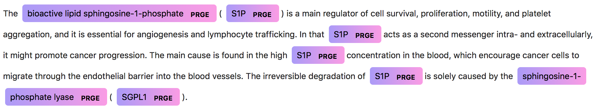

<h1 align="center">
  <br>
  Saber
  <br>
</h1>

<p align="center"><b>Saber</b> (<b>S</b>equence <b>A</b>nnotator for <b>B</b>iomedical <b>E</b>ntities and <b>R</b>elations) is a deep-learning based tool for <b>information extraction</b> in the biomedical domain.
</p>

<p align="center">
  <a href="https://travis-ci.org/BaderLab/saber">
    
  </a>
  <a href="https://www.codacy.com/app/JohnGiorgi/Saber?utm_source=github.com&amp;utm_medium=referral&amp;utm_content=BaderLab/saber&amp;utm_campaign=Badge_Grade">
    
  </a>
  <a href='https://coveralls.io/github/BaderLab/saber?branch=master'>
    
  </a>
  <a href='https://baderlab-saber.readthedocs.io/en/latest/?badge=latest'>
    
  </a>
  <a href='https://spacy.io'>
    
  </a>
  <a href='https://opensource.org/licenses/MIT'>
    
  </a>
</p>

<p align="center">
  <a href="#installation">Installation</a> •
  <a href="#quickstart">Quickstart</a> •
  <a href="#resources">Resources</a>
</p>

<p align="center">
  
</p>

## Installation

**Disclaimer: Currently a pre-alpha, work in progress!**

To install Saber, you will need `python>=3.6`. If not already installed, `python>=3.6` can be installed via:

 - the [official installer](https://www.python.org/downloads/)
 - [Homebrew](https://brew.sh), on MacOS (`brew install python3`)
 - [Miniconda3](https://conda.io/miniconda.html) / [Anaconda3](https://www.anaconda.com/download/)

> Use `python --version` at the command line to make sure installation was successful. Note: you may need to use `python3` (not just `python`) at the command line depending on your install method.

(OPTIONAL) Activate your virtual environment (see [below](#optional-creating-and-activating-virtual-environments) for help):

```bash
$ source activate saber
# Notice your command prompt has changed to indicate that the environment is active
(saber) $
```

Install Saber right from this repository with `pip`

```bash
(saber) $ pip install git+https://github.com/BaderLab/saber.git
```

or by cloning the repository and then using `pip` to install the package

```bash
(saber) $ git clone https://github.com/BaderLab/saber.git
(saber) $ cd saber
(saber) $ pip install .
```

> You can also install Saber by cloning this repository and running `python setup.py install`

Finally, you must also `pip` install the required [Spacy](https://spacy.io) model and the [keras-contrib](https://github.com/keras-team/keras-contrib) repositories

```bash
# keras-contrib
(saber) $ pip install git+https://www.github.com/keras-team/keras-contrib.git
# spacy small english model
(saber) $ pip install https://github.com/explosion/spacy-models/releases/download/en_core_web_sm-2.0.0/en_core_web_sm-2.0.0.tar.gz#en_core_web_sm
```

> See [Running tests](#running-tests) for a way to verify your installation.


### (OPTIONAL) Creating and activating virtual environments

When using `pip` it is generally recommended to install packages in a virtual environment to avoid modifying system state. To create a virtual environment named `saber`:

#### Using virtualenv or venv

Using [virtualenv](https://virtualenv.pypa.io/en/stable/):

```bash
$ virtualenv /path/to/new/venv/saber
```

Using [venv](https://docs.python.org/3/library/venv.html):

```bash
$ python3 -m venv /path/to/new/venv/saber
```

Next, you need to activate the environment.

```bash
$ source /path/to/new/venv/saber/bin/activate

# Notice your command prompt has changed to indicate that the environment is active
(saber) $
```

#### Using Conda

If you use [Conda](https://conda.io/docs/) / [Miniconda](https://repo.continuum.io/miniconda/Miniconda3-latest-Linux-x86_64.sh), you can create an environment named `saber` by running:

```bash
$ conda create -n saber python=3
```

To activate the environment:

```bash
$ source activate saber

# Again, your command prompt should change to indicate that the environment is active
(saber) $
```

> Note: you do not need to name the environment `saber`.

## Quickstart

You can interact with Saber as a web-service, command line tool, python package, or via the Juypter notebooks. If you created a virtual environment, **remember to activate it first**.

### Web-service

To use Saber as a **local** web-service, run:

``` bash
(saber) $ python -m saber.app
```

To build & run Saber with __Docker__:

``` bash
# Build docker
(saber) $ docker build -t saber .

# Run docker (use `-it` instead of `-dt` to try it interactively)
(saber) $ docker run --rm -p 5000:5000 --name saber1 -dt saber
```

There are currently two endpoints, `/annotate/text` and `/annotate/pmid`. Both expect a `POST` request with a JSON payload, e.g.:

```json
{
  "text": "The phosphorylation of Hdm2 by MK2 promotes the ubiquitination of p53."
}
```

Or:

```json
{
  "pmid": 11835401
}
```

For example, running the web-service locally and using `cURL`:

```bash
$ curl -X POST 'http://localhost:5000/annotate/text' \
--data '{"text": "The phosphorylation of Hdm2 by MK2 promotes the ubiquitination of p53."}'
```

> Full documentation for the Saber API can be found [here](https://baderlab.github.io/saber-api-docs/).

### Command line tool

All hyper-parameters are specified in a configuration file. The configuration file can be specified when running Saber:

```bash
(saber) $ python -m saber.train --config_filepath path/to/config.ini
```

> If not specified, the default configuration file at `saber/config.ini` is used.

Alternatively, you can supply arguments at the command line. Each command line argument has a name identical to those found in `saber/config.ini`. For example:

```bash
(saber) $ python -m saber.train --dataset_folder path/to/dataset --k_folds 10
```

Would overwrite the arguments for `dataset_folder` and `k_folds` found in the config file.

> Note: At this time, the command-line tool simply trains the model.

#### Preparing a corpus for training

Any corpus used for training must be in a CoNLL format with a BIO tag scheme (see [Datasets](#datasets)):

- To use k-fold cross-validation, simply provide a `train.*` file at `dataset_folder`.
- To use a train/valid/test strategy, provide `train.*` and `test.*` files at `dataset_folder`. Optionally, you can provide a `valid.*` file. If not provided, a random 10% of examples from `train.*` are used as the validation set.

### Python module

Saber exposes its functionality through the `SequenceProcessor` class. Here is just about everything Saber does in one script:

```python
from saber.sequence_processor import SequenceProcessor

# First, create a SequenceProcessor object, which exposes Sabers functionality
sp = SequenceProcessor()

# Load a dataset and create a model (provide a list of datasets to use multi-task learning!)
sp.load_dataset('path/to/datasets/GENIA')
sp.create_model()

# Train and save a model
sp.fit()
sp.save('pretrained_models/GENIA')

# Load a model
del sp
sp = SequenceProcessor()
sp.load('pretrained_models/GENIA')

# Perform prediction on raw text, get resulting annotation
raw_text = 'The phosphorylation of Hdm2 by MK2 promotes the ubiquitination of p53.'
annotation = sp.annotate(raw_text)

# Use transfer learning to continue training on a new dataset
sp.load_dataset('path/to/datasets/CRAFT')
sp.fit()
```
### Juypter notebooks

First, install [JupyterLab](https://github.com/jupyterlab/jupyterlab) by following the instructions [here](https://github.com/jupyterlab/jupyterlab#installation) (make sure to activate your virtual environment first if you created one!)

Once installed, run:

```
(saber) $ jupyter lab
```

> Note: if you activated a virtual enviornment make sure you see **Python [conda env:saber]** in the top right of the Jupyter notebook.

Check out `notebooks/lightning_tour.ipynb` for an overview.

## Resources

### Documentation

Currently, the jupyter notebook `notebooks/lightning_tour.ipynb` is serving as the primary documentation for Saber. Documentation for the Saber web-service API can be found [here](https://baderlab.github.io/saber-api-docs/).

### Datasets

Currently, Saber requires corpora to be in a **CoNLL** format with a BIO tag scheme, e.g.:

```
Selegiline	B-CHED
-	O
induced	O
postural	B-DISO
hypotension	I-DISO
...
```

Corpora in such a format are collected in [here](https://github.com/BaderLab/Biomedical-Corpora) for convenience.

> Many of the corpora in the BIO and IOBES tag format were originally collected by [Crichton _et al_., 2017](https://doi.org/10.1186/s12859-017-1776-8), [here](https://github.com/cambridgeltl/MTL-Bioinformatics-2016).

Corpora in the **Standoff** format can be converted to **CoNLL** format using [this](https://github.com/spyysalo/standoff2conll) tool. Corpora in **PubTator** format can be converted to **Standoff** first using [this](https://github.com/spyysalo/pubtator) tool.

### Word embeddings

When training new models, you can (and should) provide your own pre-trained word embeddings with the `pretrained_embeddings` argument (either at the command line or in the configuration file). Saber expects all word embeddings to be in the `word2vec` file format. [Pyysalo _et al_. 2013](https://pdfs.semanticscholar.org/e2f2/8568031e1902d4f8ee818261f0f2c20de6dd.pdf) provide word embeddings that work quite well in the biomedical domain, which can be downloaded [here](http://bio.nlplab.org). Alternatively, from the command line call:

```bash
$ mkdir saber/word_embeddings
$ cd saber/word_embeddings
# Note: this file is over 4GB
$ wget http://evexdb.org/pmresources/vec-space-models/wikipedia-pubmed-and-PMC-w2v.bin
```

> Note: you do not need to download pre-trained word embeddings if you only plan on using Saber's pre-trained models.

#### GloVe

To use [GloVe](https://nlp.stanford.edu/projects/glove/) embeddings, just convert them to the [word2vec](https://code.google.com/archive/p/word2vec/) format first:

```bash
(saber) $ python
>>> from gensim.scripts.glove2word2vec import glove2word2vec
>>> glove_input_file = 'glove.txt'
>>> word2vec_output_file = 'word2vec.txt'
>>> glove2word2vec(glove_input_file, word2vec_output_file)
```

## Running tests

Sabers test suite can be found in `saber/tests`. In order to run the tests, you'll usually want to clone the repository locally. Make sure to install all required development dependencies defined in ``requirements.txt``. Additionally, you will need to install ``pytest``:

```bash
(saber) $ pip install pytest
```

To run the tests:

```bash
(saber) $ cd path/to/saber
(saber) $ py.test saber
```

Alternatively, you can find out where Saber is installed and run ``pytest`` on
that directory:

```bash
# Find out where Saber is installed
$ python -c "import os; import saber; print(os.path.dirname(saber.__file__))"
# Run tests on that installation directory
(saber) $ python -m pytest <Saber-directory>
```
